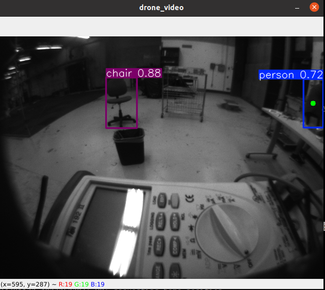
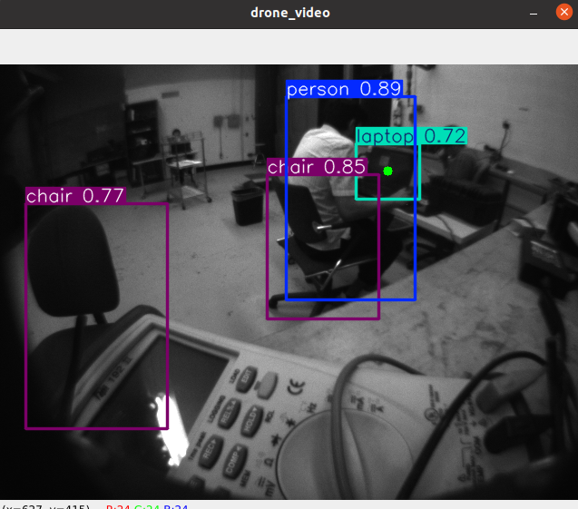
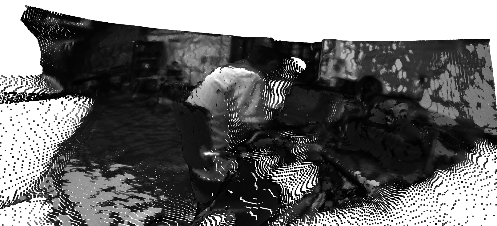

# Depth Estimation for Monocular Camera With the Qualcomm RB5 Drone

## Overview

This repository contains the implementation of a depth estimation system using a monocular camera mounted on the Qualcomm RB5 Drone. The goal of the project is to leverage computer vision techniques to estimate depth information from a single camera feed, which can be useful for various drone applications such as obstacle avoidance, navigation, and 3D scene reconstruction. 

## Example 1
<table>
  <tr>
    <td align="center">
      <br>
      <b>Object Detection</b>
    </td>
    <td align="center">
      <br>
      <b>3D Point Cloud</b>
    </td>
  </tr>
</table>

## Example 2
<table>
  <tr>
    <td align="center">
      <br>
      <b>Object Detection</b>
    </td>
    <td align="center">
      <br>
      <b>3D Point Cloud</b>
    </td>
  </tr>
</table>


## Features

- Monocular Depth Estimation: Extracts depth information from a single camera image stream using deep learning-based techniques.
- Integration with Qualcomm RB5 Drone: Utilizes the onboard processing capabilities of the Qualcomm RB5 platform for real-time depth estimation.
- ROS Compatibility: Built within the ROS (Robot Operating System) framework to ensure easy integration with other drone control and navigation systems. This provided node also publishes the estimated 2D Pose of the detected object(s) in the global frame.
- Real-time Performance: Optimized for real-time depth processing to support dynamic drone maneuvers and applications.


## Requirements

### Hardware

  - Qualcomm RB5 Drone
  - Host Computer with Display

### Software

  - Docker>=20.0
  - Ubuntu 20.04 (tested on Qualcomm RB5 with ROS Melodic)


## For testing the ROS Node

1. Clone the repository with `git clone https://github.com/angelcervant1/rb5_vision.git`
3. Enter into the folder and build the package with `catkin_make`
4. Build the docker image with `docker build -t rb5_vision .`
5. Make sure to add docker to xhost group with `xhost +local:docker` on a terminal
6. Make sure to be running the [voxl-mpa-to-ros](https://gitlab.com/voxl-public/voxl-sdk/utilities/voxl-mpa-to-ros) node inside the RB5 Drone
7. Set the correct `ROS IP` and `ROS MASTER URI` on both devices for the code to run propperly.

8. Enter the container with
```
docker run --gpus all --network=host -it --privileged -e DISPLAY=$DISPLAY -v /tmp/.X11-unix:/tmp/.X11-unix -v /dev/video0:/dev/video0 --rm rb5_vision bash
```

8. If previous code raises an nvidia-runtime or similar error. Then ignore the `--gpus all` flag and run the following command: 
```
docker run --network=host -it --privileged -e DISPLAY=$DISPLAY -v /tmp/.X11-unix:/tmp/.X11-unix -v /dev/video0:/dev/video0 --rm rb5_vision bash
```

9. When inside the container run `roslaunch depth_estimator depth_model.launch`

