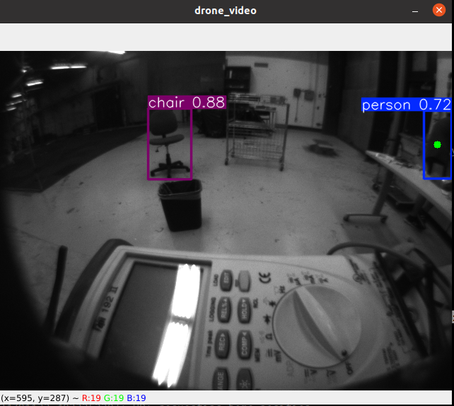
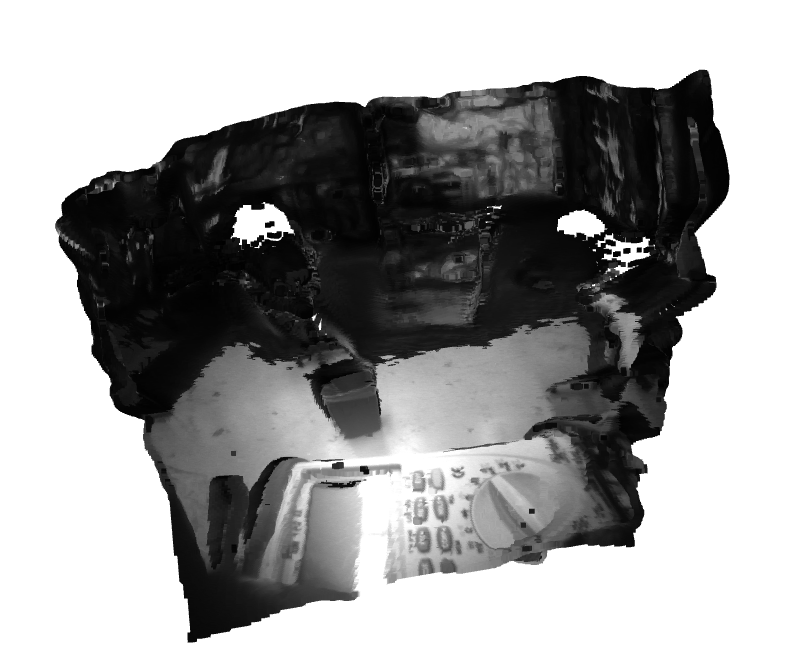

# Depth Estimation for Monocular Camera With the Qualcomm RB5 Drone

## Overview

This repository contains the implementation of a depth estimation system using a monocular camera mounted on the Qualcomm RB5 Drone. The goal of the project is to leverage computer vision techniques to estimate depth information from a single camera feed, which can be useful for various drone applications such as obstacle avoidance, navigation, and 3D scene reconstruction.

## Features

- Monocular Depth Estimation: Extracts depth information from a single camera image stream using deep learning-based techniques.
- Integration with Qualcomm RB5 Drone: Utilizes the onboard processing capabilities of the Qualcomm RB5 platform for real-time depth estimation.
- ROS Compatibility: Built within the ROS (Robot Operating System) framework to ensure easy integration with other drone control and navigation systems.
- Real-time Performance: Optimized for real-time depth processing to support dynamic drone maneuvers and applications.

## Requirements

### Hardware

    - Qualcomm RB5 Drone
    - Monocular camera (connected to the RB5 drone)

### Software

    - Ubuntu 20.04 (tested on Qualcomm RB5 with ROS Melodic)
    - ROS Noetic
    - torch==2.4.1
    - opencv-python==4.7.0.72
    - open3d==0.13.0  
    - matplotlib==3.7.5
    - numpy==1.24.3
    - ultralytics==8.2.90
    - transformers==4.44.2
    - Pillow==10.4.0

### To test out the ROS Node

1. Clone the repository 
2. Build the package with `catkin_make`
3. Build the docker image with `docker build -t "docker-name" .`
4. Make sure to add docker to xhost group with `xhost +local:docker` on a terminal
5. Enter the container with `docker run --gpus all --network=host -it --privileged -e DISPLAY=$DISPLAY -v /tmp/.X11-unix:/tmp/.X11-unix -v /dev/video0:/dev/video0 --rm rb5_vision bash`
6. When inside the container run the following command `roslaunch depth_estimator depth_model.launch`

